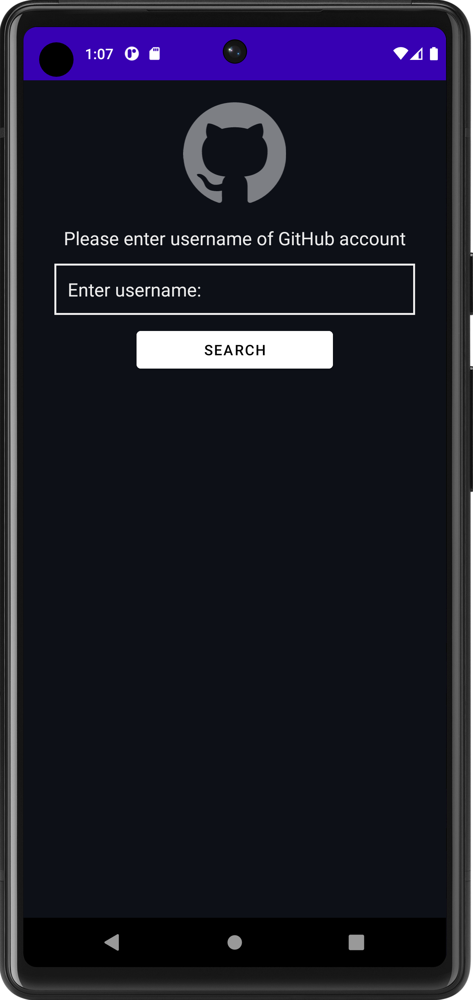

# GitHub Application

The GitHub Finder Android Application is a tool that allows users to search for repositories on GitHub and explore user profiles. It is developed using XML and Java in the Android Studio environment.

## Features

- Search for GitHub repositories by keywords.
- View repository details, including owner, description, stars, and forks.
- Explore user profiles, including followers and the accounts they follow.

## Screenshots

## Installation

1. Clone the repository or download the ZIP file.
2. Open the project in Android Studio.
3. Build and run the application on an Android emulator or a physical device.
To successfully install application you need to have installed [java](https://www.java.com/en/).

Open folder where you want to have project files, open console and then clone the repository

    git clone https://github.com/thevivekmallik/Github-App.git

## Usage

1. Launch the application.
2. Enter keywords to search for repositories or users on GitHub.
3. Browse through the search results and select a repository or user to view more details.

## Technologies Used

- Android Studio
- Java
- XML

## Contributing

Contributions are welcome! Please fork the repository and submit a pull request.

